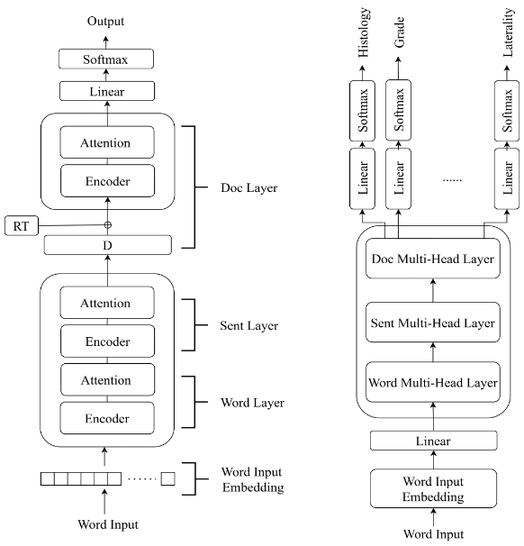

# Supplementary Material for Hierarchical Temporal Attention Networks for Cancer Registry Abstraction: Leveraging Longitudinal Clinical Data with Interpretability

This is the project website for the paper "Hierarchical Temporal Attention Networks for Cancer Registry Abstraction: Leveraging Longitudinal Clinical Data with Interpretability", published in IEEE Journal of Biomedical and Health Informatics (JBHI).

If you have used any resources provided by this project, please cite our paper:

> H.-J. Dai and H.-H. Wu, "Hierarchical Temporal Attention Networks for Cancer Registry Abstraction: Leveraging Longitudinal Clinical Data with Interpretability," *IEEE Journal of Biomedical and Health Informatics*, 2025. doi: [10.1109/JBHI.2025.3592444](https://doi.org/10.1109/JBHI.2025.3592444)


## A. Report Types Included in This Study

Fig. A.I shows the architecture of the proposed hierarchical temporal attention network (HTAN) and multi-head HTAN (MHHTAN). The report types considered in this study include: angiogram reports, cardiac ultrasound (US) reports, colonoscopy reports, computed tomography reports, echocardiogram reports, endoscopy reports, intervention reports, endoscopic retrograde cholangiopancreatography examination reports, lower limb arterial US reports, lower limb venous US reports, magnetic resonance imaging reports, mammography reports, nuclear medicine reports, pathology reports, plain file reports, special reports, and transesophageal echocardiogram reports.


<p align="center">
  
</p>

**Fig. A.I.** (Left) Architecture of the proposed HTAN. (Right) Architecture of the proposed MHHTAN.

---

## B. Dataset Curation Procedure and Summary of Coding Items

To compile the training, validation, and test set for the presented abstraction task, we applied a data filtering procedure based on the recommendations of expert cancer registrars. This procedure aimed to prevent data quality issues that could affect subsequent model performance assessments.

In the first step, we collected patients’ registry records and the corresponding reports from the cancer registry database of KMUH. Only patients with a single registry record were included to exclude cases involving multiple primary cancers where a patient is diagnosed with more than one type of cancer.

In the second step, we applied the following excluding criteria:

- **Non-in-hospital-diagnosed or non-in-hospital-treated patients**:  
  Records that included reports from external hospitals were excluded due to concerns that incomplete cancer reports might lead to missing data.

- **Patients diagnosed before January 1, 2018**:  
  Based on the Taiwan Cancer Registry handbook, patients diagnosed before this date were staged under earlier versions of the AJCC system and were therefore excluded.

- **Patients with BH codes of 0 or 6**:  
  Following expert recommendations, we excluded patients with a BH code of 0 (indicating benign tumors) or 6 (indicating metastatic cancer with unknown PS).

The third step involved ensuring the completeness of the cancer registration data by establishing inclusion criteria:
1. Patients must have at least one pathology report and one examination report.
2. The patient’s first report must be earlier than the initial diagnosis date.
3. The date of the last report must be later than the date of the first surgery.

Finally, the resulting patients were classified into six cancer categories based on their PS information.

**Table B.I.** Summary of Coding Items Considered in This Study

| Item | Description |
|:-----|:------------|
| The Edition and Chapter of AJCC Cancer Staging (AJCC) | Version and chapter of the AJCC cancer staging system. |
| Behavior (BH) | The BH or the 5th digit of the M-code code in the pathological diagnosis. |
| Chemotherapy at This Facility (CHEMO) | The status of chemotherapy in the patient's first treatment course. |
| Diagnostic Confirmation (DC) | The most precise basis of diagnosis. |
| Grade/Differentiation Pathological (PATH_G) | Grading/differentiation of the solid tumor after surgery at the PS. |
| Histology (HS) | Structure of the primary tumor cells under the microscope. |
| Hormone/Steroid Therapy at This Facility (HT) | The details of hormone/steroid therapy administered during the first treatment course at the reporting hospital. |
| Immunotherapy at This Facility (IT) | The details of immunotherapy administered during the first treatment course at the reporting hospital. |
| Laterality (LL) | The side of the body or paired organs where the cancer originates. |
| Lymph vessels or Vascular Invasion (LVI) | Indicates whether lymphatic or vascular invasion was reported at the PS. |
| Minimally Invasive Surgery (MIS) | Records whether minimally invasive or robotic surgery was performed. |
| Surgical Margins of the PS (SM) | The final status of the surgical margins after tumor resection at the PS. |
| Surgical Procedure of PS at This Facility (OPTYPE) | The type of surgery performed on the PS by the reporting hospital. |
| Pathologic T (PATH_T) | Size or extent of the primary tumor. |
| Pathologic N (PATH_N) | Regional lymph node metastasis and its extent. |
| Pathologic M (PATH_M) | The presence of distant metastasis. |
| Pathologic Stage (Prefix/Suffix) Descriptor (PATH_SD) | Descriptive symbols for the prefix and suffix of AJCC pathological staging. |
| Pathologic Stage Group (PATH_SG) | The anatomical extent of disease based on pathological T, N, and M. |
| Perineural Invasion (PI) | Records the presence of perineural invasion at the PS. |
| Primary Site (PS) | The PS of the cancer. |
| Scope of Regional Lymph Node Surgery at This Facility (SRLN) | The extent of surgery at the PS, including regional lymph node dissection, biopsy, or aspiration. |
| Surgical Diagnostic and Staging Procedure at This Facility (SD) | Surgical procedures performed by the reporting hospital for diagnosis or staging. |
| Targeted therapy at This Facility (TARGET) | The details of targeted therapy administered during the first treatment course at the reporting hospital. |

---

## C. Odd Ratio Analysis Between Models over Baseline

We investigate the comparative performance of 23 coding items for the developed models, focusing on their likelihood of outperforming the baseline, MODE. Using an OR framework, we quantified the relative strength of each algorithm’s performance advantage over MODE. Three analyses were conducted where the models were trained and tested on the same datasets, BC, CRC and EC, to compare their odds of outperforming MODE. 

### 1)	Case and Control Definitions

-	Cases: Coding tasks where the algorithm performed better than MODE based on F1-score.
-	Controls: Coding tasks where the algorithm did not perform better than MODE.

### 2)	Study Variables

We used MTCNN as the reference group to compare against three developed algorithms: HAN, HTAN and MMHTAN.

### 3)	Data Collection

The BC, CRC and EC datasets were used for evaluation. For each trial, we determined whether the model outperformed MODE or underperformed MODE.

### 4)	OR and p-value Calculation

The ORs were calculated based on a contingency table consisting of the frequency of cases and controls for each algorithm. Fisher’s exact test was used to calculate p-values. TABLE C.I shows the results.

**Table C.I** — Odds Ratio Analysis on the BC, CRC, and EC Datasets

### BC Dataset
| Model   | Cases | Controls | OR     | 95% CI        | p-value |
|---------|-------|----------|--------|---------------|---------|
| MTCNN   | 11    | 7        | Reference | —             | —       |
| HAN     | 11    | 7        | 1      | 0.262–7.136   | 1       |
| HTAN    | 15    | 7        | 0.733  | 0.199–6.889   | 0.744   |
| MHHTAN  | 15    | 6        | 0.629  | 0.165–7.132   | 0.520   |

### CRC Dataset
| Model   | Cases | Controls | OR     | 95% CI        | p-value |
|---------|-------|----------|--------|---------------|---------|
| MTCNN   | 14    | 7        | Reference | —             | —       |
| HAN     | 15    | 6        | -0.223 | 0.216–6.933   | 1       |
| HTAN    | 17    | 4        | -0.754 | 0.114–7.711   | 0.484   |
| MHHTAN  | 17    | 4        | -0.754 | 0.114–7.711   | 0.484   |

### EC Dataset
| Model   | Cases | Controls | OR     | 95% CI        | p-value |
|---------|-------|----------|--------|---------------|---------|
| MTCNN   | 8     | 9        | Reference | —             | —       |
| HAN     | 5     | 8        | 1.422  | 0.328–8.111   | 0.721   |
| HTAN    | 6     | 9        | 1.333  | 0.327–7.614   | 0.735   |
| MHHTAN  | 6     | 10       | 1.481  | 0.369–7.499   | 0.728   |


In the BC dataset, the OR for MTCNN relative to HAN is 1, indicating equal odds of outperforming MODE. However, the ORs for MTCNN relative to HTAN variants including HTAN and MMHTAN are lower than 1, suggesting that HTAN variants have higher odds of outperforming MODE. In contrast, for the smaller EC dataset, the ORs for all three compared models are greater than 1, indicating that MTCHH is preferred over the others. The ranking for the EC dataset follows: MTCNN, HTAN, HAN and MHHTAN. For the CRC dataset, HTAN and MHHTAN have equal odds of outperforming MODE, which are higher than HAN, followed by MTCNN.

---

## D. Experimental Configurations Details 

Aside from implementing MTCNN using Keras, all deep learning model architectures were implemented with PyTorch. The pre-trained embedding used for all models were BioWordVec, with a dimension of 200. The models were trained for up to 200 epochs with an initial learning rate is 10-3. The optimizer used was AdamW, with early stopping added to prevent overfitting, using a patient threshold of 15 iterations. The loss function used for all models was cross entropy loss, as defined in (19). TABLE B.I lists the hyper-parameters used in the experiments for this study. TABLE B.II provides the number of trainable parameters for the developed models. All experiments were conducted on a Windows server equipped with a single NVIDIA RTX A6000 Ada GPU.  

---

## E. patient_stratification.py - Cancer Registry Patient Stratification & Data Conversion

This script performs patient-level stratified dataset generation for cancer registry tasks. It scores and splits patients based on label distributions, then outputs structured JSON and compressed GZIP files for downstream model training.

---

# patient_stratification.py - Cancer Registry Patient Stratification & Data Conversion

This script performs patient-level stratified dataset generation for cancer registry tasks. It scores and splits patients based on label distributions, then outputs structured JSON and compressed GZIP files for downstream model training.

---

## Input Data Format

```json
{
  "Reports": [
    {
      "Sentences": ["sentence1", "sentence2", "..."],
      "Reports_Type": "e.g., Pathology"
    },
    ...
  ],
  "ID": "1234",
  "HISTOLOGY": "...",
  "BEHAVIOR": "...",
  "GRADE_P": "...",
  ...
}
```

- The file should contain a list of such patient records.
- Each field like **HISTOLOGY**,**GRADE_P**,etc., corresponds to a cancer registry task label

### Command-line Arguments

| Argument | Required | Description |
|----------|----------|-------------|
| `--model-type` | No | Output format: `mhhtan` (with report type), or `han` (without). Default: `mhhtan`. |
| `--raw-data-folder` | Yes | Path to the folder containing raw JSON patient files. |
| `--cancers` | No | Comma-separated list of cancer types to process. Default: `breast,colorectal,liver,oral,prostate,uterus`. |
| `--hospital` | No | Hospital prefix for file naming. Default: `kmuh`. |
| `--file-encoding` | No | Encoding of the input files. Default: `utf-8`. |
| `--labels` | No | Comma-separated cancer registry label fields. Default: includes 23 common fields. |
| `--data-rows` | No | Field list to include in output. Default: full patient structure. |
| `--stratification-number` | No | Number of stratified partitions. Default: 4. |
| `--trainset-ratio` | No | Proportion of training samples per split. Default: 0.8. |
| `--validset-ratio` | No | Proportion of validation samples per split. Default: 0.1. |
| `--id-proportion-path` | No | Output CSV path for ID distribution. Default: `./id_proportion.csv`. |
| `--label-distribute-path` | No | Output CSV path for label distribution. Default: `./labels_distribute.csv`. |
| `--output-json-path` | No | Folder for saving output JSON files. Default: `./json_data`. |
| `--output-gzip-path` | No | Folder for saving output GZIP files. Default: `./gzip_data`. |

### Usage Example

```bash
python patient_stratification.py \
  --model-type mhhtan \
  --raw-data-folder ./raw_data \
  --output-json-path ./json_data \
  --output-gzip-path ./gzip_data \
  --hospital kmuh
  ```

---


### Output Structure

Each output JSON contains:

```json
{
  "data": [...],       // list of tuples (ID, Reports, labels...)
  "splits": [0,1,2...], // 0: train, 1: test, 2: val
  "rows": [...]        // feature/label field names
}
```
